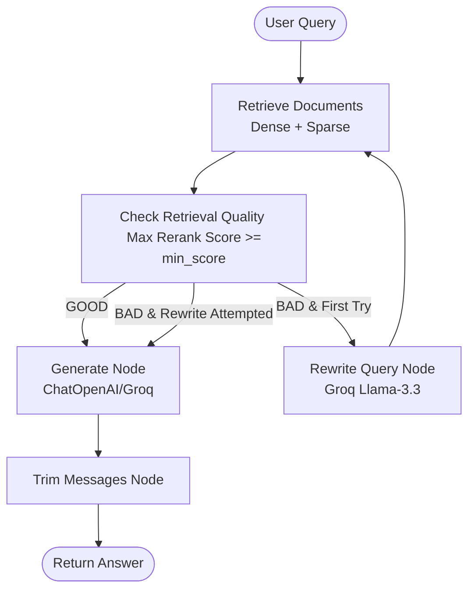

# Hybrid RAG Assistant with LangGraph Query Rewriting & Reranking

A state-of-the-art hybrid Retrieval-Augmented Generation (RAG) system built with **LangGraph**, combining dense vector search, sparse keyword search, reciprocal rank fusion (RRF), Voyage AI reranking, and dynamic query rewriting.

---

## 🚀 Key Features

*   **Hybrid Retrieval**: Combines Dense semantic search (Pinecone + Voyage AI Embeddings) with Sparse keyword search (BM25) for maximum retrieval accuracy.
*   **Reciprocal Rank Fusion (RRF)**: Merges sparse and dense search results into a unified ranked list.
*   **Voyage AI Reranking**: Uses Voyage AI's reranking model (`rerank-2.5-lite`) to filter and elevate the most relevant document chunks.
*   **LangGraph Orchestrated Workflow**:
    *   **Conditional Routing**: Evaluates the relevance score of retrieved documents against a configurable threshold.
    *   **Dynamic Query Rewriting**: If retrieval quality is poor, routes queries to a Groq-powered rewriter (`llama-3.3-70b-versatile`) to resolve ambiguities, expand terminology, and re-attempt retrieval.
    *   **Loop Prevention**: Restricts re-attempts to a single rewrite cycle to guarantee termination.
*   **Interactive Streamlit UI**: Chat interface with detailed source citations, rerank scores, and toggleable LLM parameters (provider, model, temperature, threshold).
*   **Local File Ingestion**: In-app document uploads (supports Word, PDF, Text) that index directly into Pinecone.

---

## 📊 System Architecture



---

## 🛠️ Tech Stack

*   **Orchestration**: LangGraph
*   **Vector DB**: Pinecone
*   **Embeddings & Reranker**: Voyage AI (`voyage-3-lite` & `rerank-2.5-lite`)
*   **Language Models**: Groq (`llama-3.3-70b-versatile`) & OpenRouter (`nemotron-3-ultra-550b-a55b`)
*   **UI Framework**: Streamlit

---

## ⚙️ Setup & Installation

### 1. Prerequisites
Ensure you have Python 3.10+ installed.

### 2. Clone and Install Dependencies
```bash
git clone https://github.com/Asadnaeem23/Hybrid-Rag.git
cd Hybrid-Rag

# Create a virtual environment
python -m venv .venv
source .venv/bin/activate  # On Windows: .venv\Scripts\activate

# Install requirements
pip install -e .
```

### 3. Environment Variables
Create a `.env` file in the root directory:
```env
# Pinecone Setup
PINECONE_API_KEY=your_pinecone_api_key
PINECONE_INDEX_NAME=hybrid-rag-dense

# API Keys
VOYAGE_API_KEY=your_voyage_api_key
GROQ_API_KEY_1=your_groq_api_key
OPENROUTER_API_KEY_1=your_openrouter_api_key
```

### 4. Running the Application
```bash
streamlit run app.py
```
Open [http://localhost:8501](http://localhost:8501) in your browser.

---

## 📁 Repository Structure

*   `app.py`: Streamlit main application.
*   `src/`: Core Python sources.
    *   `graph.py`: Graph definition and edge routing logic.
    *   `graph_nodes.py`: Execution nodes (Retrieve, Rewrite, Quality Check, Generate).
    *   `graph_state.py`: Shared graph state definitions.
    *   `query_rewriter.py`: Groq query optimizer configurations.
    *   `hybrid_retrieval.py`: Hybrid search pipeline joining Dense + BM25.
    *   `reranking.py`: Voyage AI reranker implementation.
    *   `config.py`: Configuration and environment wrappers.
*   `notebooks/setup.ipynb`: Interactive sandbox notebook for testing individual nodes.
